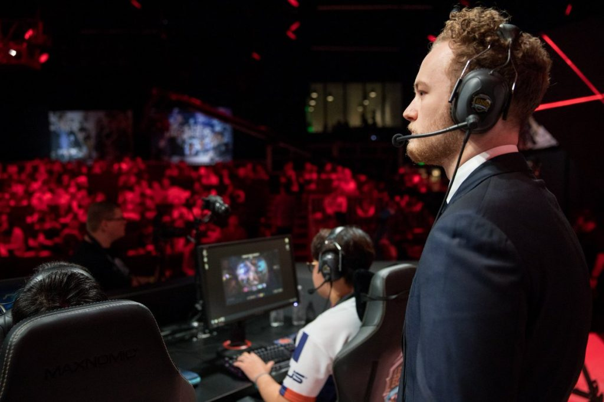
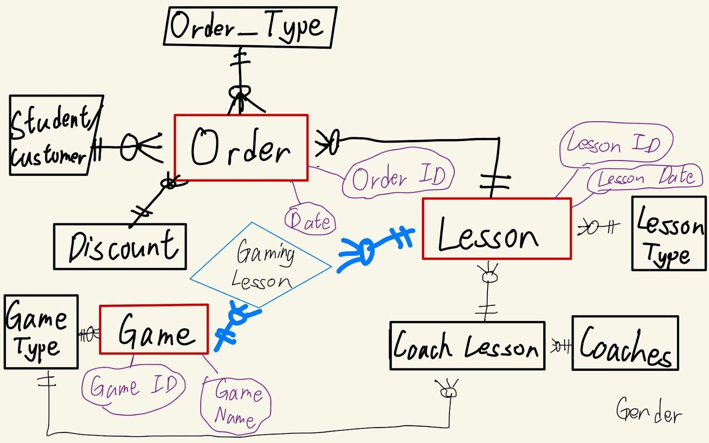
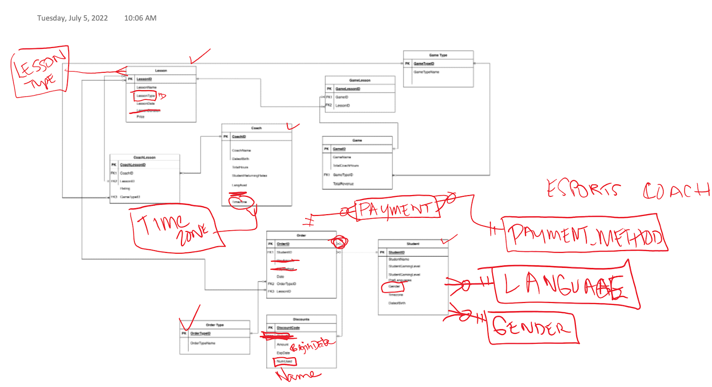
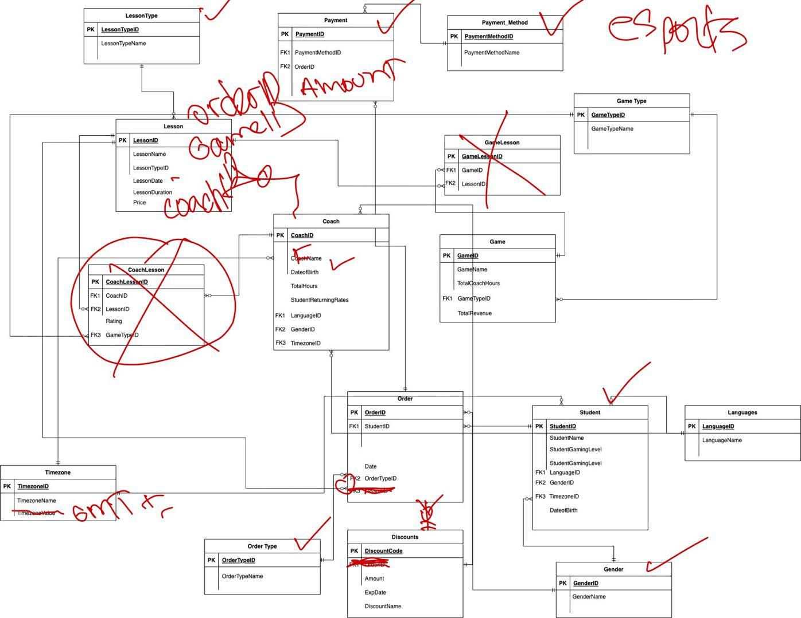
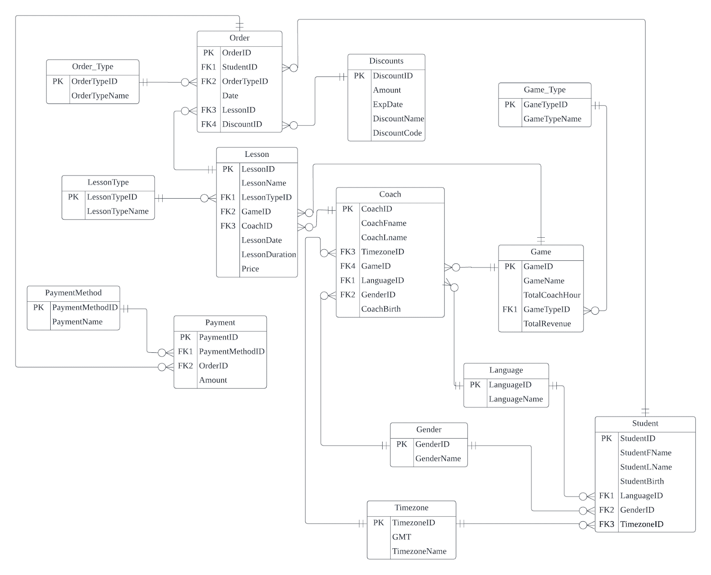

# Esports Coaching Platform Database

---

**In most areas of life, when you want to get better at things, the solution is simple, you get a coach. There are coaches for sports, music, martial arts, yoga, etc. There is always someone you can count on to bring you to the next level.**

---

However, this isn’t the case with Gaming. Typically people think it’s  sweaty that anyone would take gaming seriously enough to need coaching. In fact for most Esports, coaching is a privilege only enjoyed by the top level players. With this in mind, we are creating a database for an Esports Coaching Platform.

Through this platform, anyone can get 1-on-1 coaching with their favorite top players through voice call or text.

Now when we are designing this database, stakeholders are both students and coaches. Because we need a good amount of top level coaches to attract students, and also we need to have a large amount of customers to tell the coaches that joining our platform is worth their time.

Our initial **Conceptual Diagram** design was thus pretty simple. Our main entities here are: Students, Orders, Lessons, Coaches, and Games.

Students first choose the game they want to get better at. Then they pick a coach and select their desired lesson type. This is then translated into our **Initial ERD**. Essentially this diagram is the same as a diagram for online shopping. The only thing different here is that lessons and orders have a one to many relationship instead of many to many. One lesson can have many orders, but you can only order one lesson at a time.

As shown in the annotations, there are many flaws with this design. Mostly this table isn't fully normalized with its dependencies. We solved this issue by identifying unique informational themes and creating more tables like Payment, Language, Gender, Lesson_Type, etc. This led to our **Second Draft** shown below.

In this version, we discovered even more errors. Because we hastily concluded the relationships between table Coach, Game, Lesson, we incorrectly established some Many-to-Many relationships and created some bridge tables which turned out to be unnecessary.

Aside from this, we also made mistakes like having the Crow's Foot Notation going the wrong directions, and not putting Foreign Keys where they belong, etc. All these revisions led to our **Final ERD**.

Throughout this process, I learned many key lessons about Normalizing tables through repeated mistakes. I learned principles like always put Foreign Keys where the fork is pointing towards, create more tables whenever there is more than one business concept or informational theme in a table, always thoroughly understand the business and the relationship between tables before connecting them, etc.